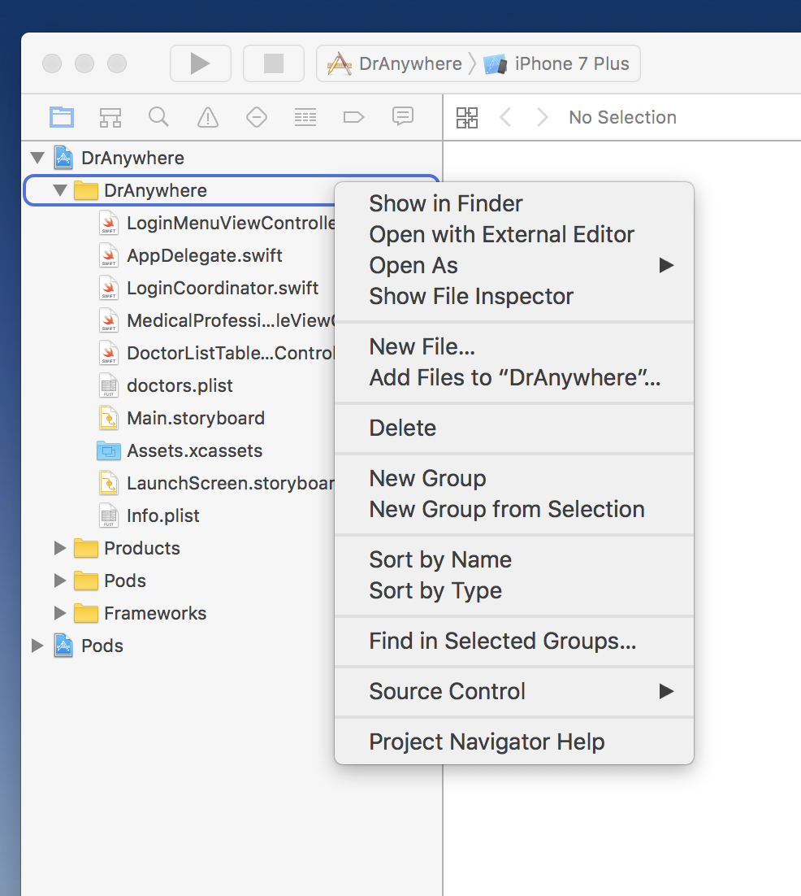
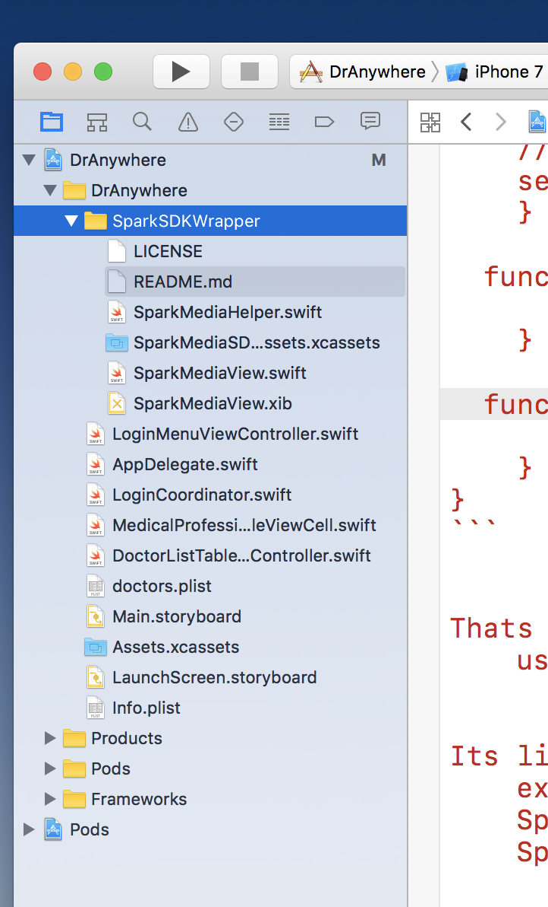
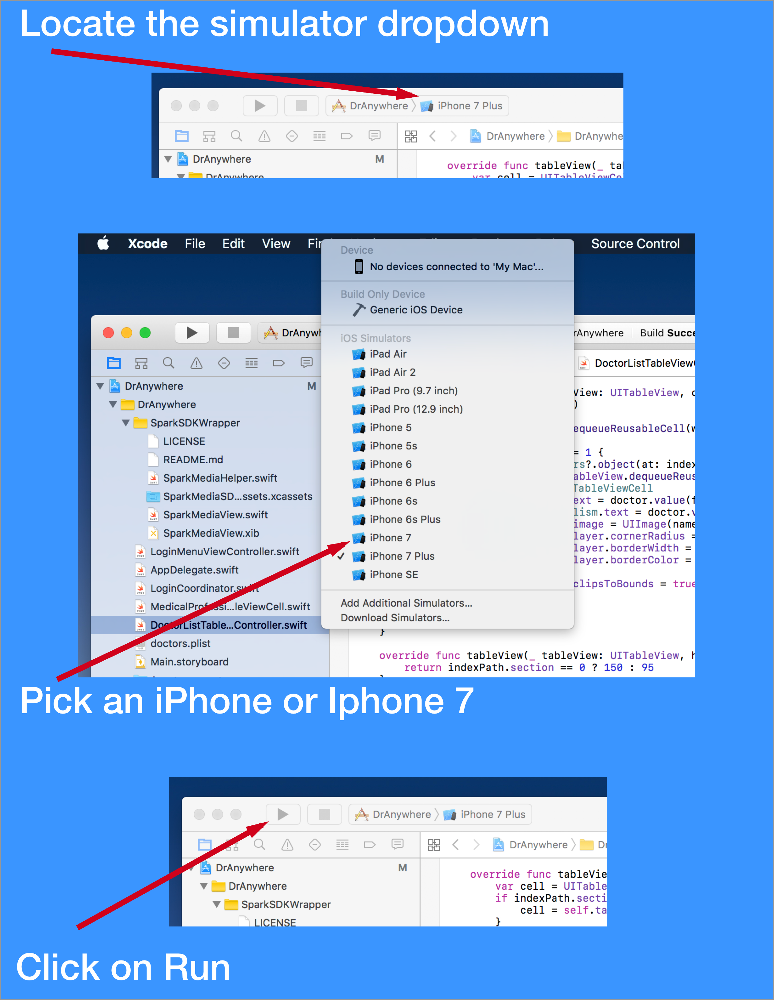
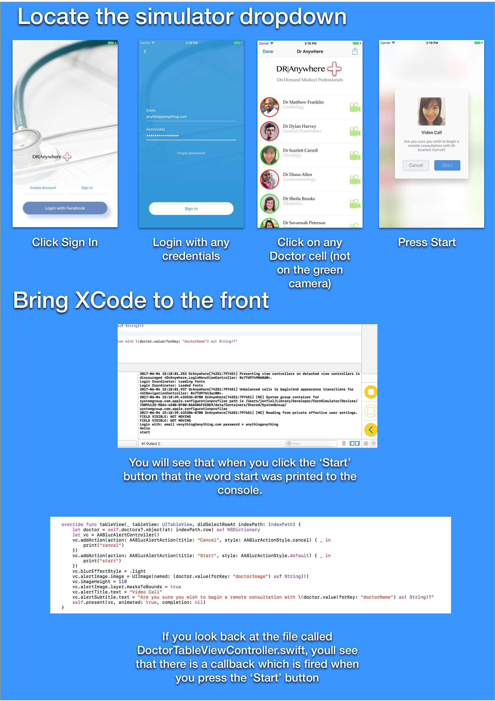
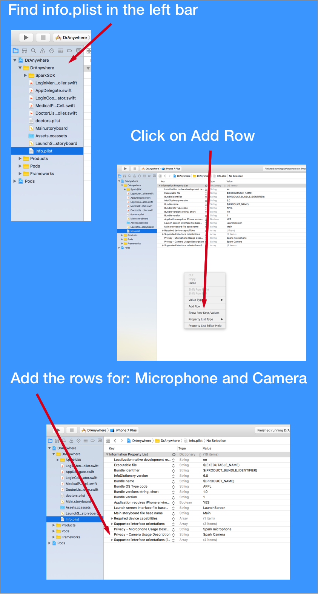

# SparkSDKDoctorAnywhere
SEVT Advanced iOS Video SDK Tutorial

# Cisco Spark Video SDK - SEVT Lab 3
### Adding Voice and Video to an existing App from Scratch

## Pre-Requisites
This Lab assumes that you have installed all the dependent software used in labs 1 and 2.

# Overview
The goal of this lab is to show the process that a developer would take to implement point to point voice and video calling into an existing iOS App. The scenario that we will use for this lab is a demo project called ‘DrAnywhere’. In its current form the app lets you log in, view a list of on demand medical professionals, with the ability to click on a specific doctor which will  show a Start Call button. 

The app in its currently has no way of being able to make a voice or video call, so we will use integrate the Spark SDK into this app to allow patients to connect to a Doctor directly inside the DrAnywhere App.


# Instructions
1. Clone a copy of the DrAnywhere source code to your local machine by opening the Terminal and running the command `git clone https://github.com/jfield44/sparksdkdranywhere.git`.
2. Now we need to move the Terminal into the freshly downloaded project, run the command `cd sparksdkdranywhere`.
3. The next step is to include the SparkSDK in the project, this will give us the ability to embed Voice and Video. To do this at the Terminal run the command `nano Podfile`, this will open an inline text editor.
4. You will see some text that looks like this:
``` ruby
# Uncomment the next line to define a global platform for your project
# platform :ios, '9.0'

target 'DrAnywhere' do
  # Comment the next line if you're not using Swift and don't want to use dynamic frameworks
  use_frameworks!

  # Pods for DrAnywhere
  pod "ILLoginKit"
  pod 'AABlurAlertController'
end
```

This file contains a list of third party software dependencies that the DrAnywhere project includes. We need to add the SparkSDK to that list.

Add a line to the file underneath `pod 'AABlurAlertController’` but above the `end` keyword. That line should contain `pod 'SparkSDK', '1.1'`

So your new file should look like this:

``` ruby
# Uncomment the next line to define a global platform for your project
# platform :ios, '9.0'

target 'DrAnywhere' do
  # Comment the next line if you're not using Swift and don't want to use dynamic frameworks
  use_frameworks!

  # Pods for DrAnywhere
  pod "ILLoginKit"
  pod 'AABlurAlertController'
  pod 'SparkSDK', '1.1'
end
```

At this point we need to quit out of the Text editor, to do that:
	* Press Control-O then press Enter
	* Press Control-X

1. Now run the command `pod install`, this will install the new SparkSDK into the project
2. We can now open the project in the Xcode development environment by running the command `open DrAnywhere.xcworkspace`
3. In the 2nd Lab we explored the value of ‘Wrapper libraries’, pre-written code which delivers a lot of functionality without needing any custom development. In this example instead of completely writing our own SDK code we will re-use the same wrapper classes as before but downloading them directly. To do this goto [GitHub - jfield44/SparkSDKWrapper: Embed Voice and Video calling capabilities into your iOS App in 3 lines of code using the Cisco Spark SDK with this wrapper.](https://github.com/jfield44/SparkSDKWrapper) and click on ‘Clone or Download’ then ‘Download ZIP`
4. Expand your DrAnywhere Folder in Xcode, right click on DrAnywhere and press `New Group` and name the folder `SparkSDKWrapper`

5. Open the freshly downloaded SDK wrapper code that you downloaded and drag the contents of the folder into the `SparkSDKWrapper` folder in Xcode. The folder structure should look like this:

6. Now in Xcode click on the file `DoctorListTableViewController.swift` then ,  in the top left corner of Xcode select , the simulator drop down, pick any iOS device (iPhone 7 or 7 plus are recommended), then click on Run to start the app.
7. The iOS Simulator will now launch, you can click on it much like your regular iPhone. Follow the steps below:


8. The next step is to add functionality to the project so that when you click on ‘Start’,that it will start a call to a Doctor. Reopen the file `DoctorListTableViewController.swift`. At the top of this file you will see 
``` swift
import UIKit
import AABlurAlertController
```
Add an additional line to include the SparkSDK in this project so it looks like this
``` swift
import UIKit
import AABlurAlertController
import SparkSDK
```
9. Next we need to include the 3 lines of code from the wrapper that allow us to make the call. Locate the code block
``` swift
        vc.addAction(action: AABlurAlertAction(title: "Start", style: AABlurActionStyle.default) { _ in
            print("start")
        })
```
Update this code to include the following, where you change the API_KEY and RECIPIENT to be your API KEY and your choice of recipient (remember you cannot use your personal token to call your own account).

Your code should now look like this:
``` swift
vc.addAction(action: AABlurAlertAction(title: "Start", style: AABlurActionStyle.default) { _ in
            // Who are you?
            let sparkMedia = SparkMediaView(authType: .sparkId ,apiKey: "API_KEY", delegate: self)
            // Who do you want to call? Is it Voice or Video?
            sparkMedia.videoCall(recipient: "RECIPIENT_ADDRESS")
            // Where should I display the call view?
            self.present(sparkMedia, animated: true, completion: nil)
        })
```

10. You will see there is a red warning icon after you have pasted this code. To get rid of this we need to tell our app that we are able to receive the events that are triggered by the SparkSDK at the end of a call or if the call fails.
At the top of the `DoctorListTableViewController.swift` you will see the following code:
``` swift
class DoctorListTableViewController: UITableViewController {
```
You should update this line to look like this, by adding a comma and SparkMediaViewDelegate
``` swift
class DoctorListTableViewController: UITableViewController, SparkMediaViewDelegate {
```
11. Now scroll to the bottom of the file, in-between the bottom `}` and the closing `}` of the file. Copy and paste the following code onto that empty line:
``` swift
func callDidComplete() {
        // Add your handling logic here
    }
    
  func callFailed(withError: String) {
        // Add your handling logic here
    }
```

Your code should fit into the empty line mentioned above and look like this 


12. There is one last step to do, Apple enforces a policy that when your app requests to use the camera and microphone on the iOS device that you provide some text to the user explaining when you are requesting access to those interfaces. We need to provide the text that will appear in a popup to the user when your app goes to make a call and asks to use the microphone and camera.

To do this, in the left panel of XCode click on info.plist, then in the center panel click on the whitespace and click add row, do this twice. In the two freshly created rows, add the string `Privacy - Microphone Usage Description` to the **key** column and `Spark SDK Microphone` to the **value** field, now repeat this for `Privacy - Camera Usage Description` and `Spark SDK Camera`respectively. The flow should work like the image below:



13. Go ahead and press the Run button again to run the app and you this time when you press the Start button in the app you should have a fully functioning video call!
